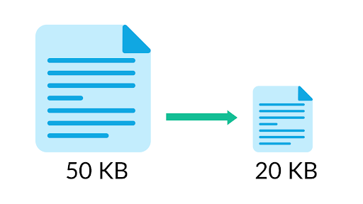
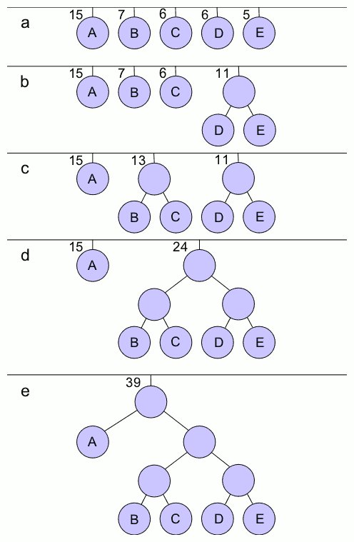

# Huffman-Compression-Decompression
Huffman’s algorithm uses a greedy method to encode data in order to save space where the higher the frequency of a byte appearing the smaller its given code so it won’t take up much space.
<p align="center"></p>

## Binary Files:
The use of binary files greatly aids Huffman’s algorithm where instead of a character taking up a whole byte it is given a code that may be less than 8 bits (1byte) thus saving space especially in the case where this character has a high frequency thus saving more overall space. In addition, the binary file approach reduces the wasted empty bits thus utilizes every bit in the file which lets it take up less overall space.
## Data Structures Used:
- HashMap for saving each N byte in a node
- PriorityQueue to build encoding tree
- Nodes that holds the data and frequency of N bytes
## Encoding:
1. File is read either byte by byte or any other specified criteria, every N bytes are read then inserted into a HashMap and with every recurrence, the frequency is increased by one.

2. A non-occurring character is placed in the HashMap with a frequency of one to act as an end of file where it’s known to be an end of file character to resolve the issue of extra bits being added to the last byte upon writing to the binary file.

3. Each entry in the HashMap is inserted into a new node then this node is inserted into a priority queue in order to build the encoding tree.

4. Priority queue compares each node’s frequency and places them in the appropriate position then through looping on the priority queue while its number of nodes is still greater than one each to smallest nodes are merged into the left and right a parent node then renters the priority queue.

5. Prefix codes are then generated for each node in the encoding tree where any left child takes a value of zero while a right child node takes a value of one.

6. Encoding the data to a binary file takes three steps, firstly the number of bytes considered together is written to the file. Then the encoded tree is saved to the file to allow for decoding from file independently. 

7. Lastly, the file itself is encoded to the binary file where its decompressing ratio depends greatly on the number of bytes considered together and most importantly the difference in frequencies of recurrence.

<p align="center"></p>

## Decoding:
1. Decoding is done by firstly reading a binary file byte by byte where the first byte indicates the number of N bytes we would consider together. 
2. Encoded tree is read next which would allow the decompressor to find the prefix coded of each N bytes and their corresponding original format. 
3. Decoding then is done through traversing the encoding tree just read and writing to file the corresponding original format of the prefix code read.

## How to Use
Run cmd inside the working directory

For Compression
```
java -jar huffman.jar 
c absolute_path_to_input_file n
```
- c means compressing the file
- n is the number of bytes that will be considered together

For Decompression
```
java -jar huffman.jar 
d absolute_path_to_input_file
```
- d means decompressing the file

## Conclusion:
Huffman’s algorithm is an efficient algorithm in compression and decompression but a downside of it, is the size the encoded tree takes in the compressed file which decreases the overall compression ratio. This could be improved through Canonical Huffman Coding where only the bit lengths are stored in the file thus improving the overall compression ratio and decreasing file size.
